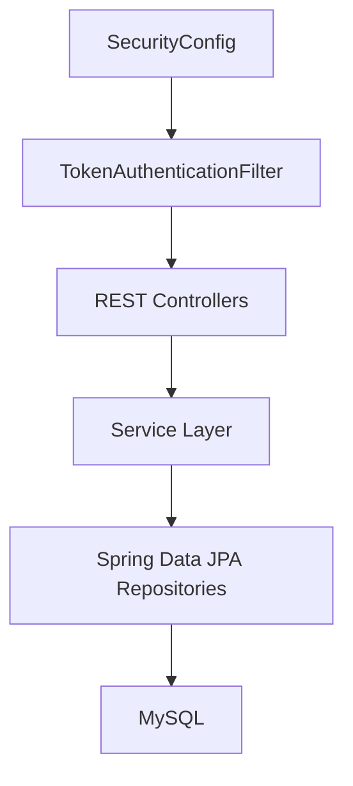

# Whiskey Store Backend

Spring Boot REST API for the Whiskey Store portfolio project.

Built with 
**Java 25**, 
**Spring Boot 4.0.5** 
**Spring Security** 
**Spring Data JPA**
**MySQL**

## Related Repository

This backend is consumed by the Angular frontend application:

- Frontend repository: [Whiskey Store Frontend](https://github.com/arthenux/whiskey-store-angular-frontend)

Replace the placeholder URL above with your published frontend repository URL.

## Purpose

The backend powers the complete commerce workflow for the application:

- public product browsing
- account registration and login
- authenticated favourites and basket management
- checkout and order creation
- role-based admin product management

This service was structured to demonstrate clean layering, practical security, and realistic business logic in a portfolio setting.

## What The Backend Implements

### Public API capabilities

- Return the whiskey catalogue
- Return individual product details
- Expose demo store information, including accepted test card details

### Authenticated customer capabilities

- Register a new customer account
- Log in and receive a bearer token
- Retrieve the authenticated user profile
- Log out and revoke active tokens
- Save and remove favourites
- Add, update, and remove basket items
- Submit checkout details and create an order
- View historical orders

### Admin capabilities

- View all products, including inactive ones
- Create new products
- Update existing products
- Delete products

## Architecture



## Design Highlights

### Clear layered structure

The codebase is separated into:

- `controller` for HTTP endpoints
- `service` for business logic
- `repository` for database access
- `entity` for persistence models
- `dto` for API request and response contracts
- `config` and `security` for application setup and authentication

This keeps the system easy to navigate during code review or technical discussion.

### Database-backed bearer-token authentication

Authentication uses opaque bearer tokens stored in the database instead of server sessions or JWTs. This approach was chosen because it is easy to explain, simple to demo, and still shows strong understanding of:

- login flow design
- token validation in a request filter
- logout/session revocation
- role-based authorization

### Realistic e-commerce workflow

The backend models the key lifecycle of an online store:

1. public catalogue access
2. authenticated basket/favourites actions
3. checkout validation
4. order creation
5. order history retrieval

### Seeded demo data

On startup, the application seeds:

- a customer account
- an admin account
- a sample whiskey catalogue

That makes the project immediately usable for demos and quick reviews without manual data setup.

## Core Business Logic

### Authentication

- Passwords are hashed with Spring Security
- Tokens are issued on successful login/registration
- Previous active tokens for the same user are revoked when a new token is issued
- Protected endpoints rely on the authentication filter plus Spring Security authorization rules

### Product catalogue

- Public endpoints return only active products
- Admin endpoints expose the full product set
- Products support featured/inactive flags
- Slugs are generated automatically to ensure consistent URL-safe identifiers

### Favourites

- Favourites are stored per user
- Duplicate favourites are prevented
- Favourites return full product information for easy frontend rendering

### Basket

- Basket items are stored per user
- Adding an existing product increases quantity instead of creating duplicate rows
- Subtotals are calculated server-side to keep business logic centralized

### Checkout and orders

- Checkout requires an authenticated user
- The demo card details are validated server-side
- Basket items are transformed into order items during checkout
- Order items snapshot product data at the time of purchase
- The basket is cleared after a successful order

### Admin product management

- Admin endpoints are protected by role
- Products can be created, updated, and deleted through dedicated admin routes

## Main Packages

```text
src/main/java/com/alan/whiskey_store_java_spring_boot_backend/
├── config
├── controller
├── dto
├── entity
├── repository
├── security
└── service
```

## Main Technologies

| Area | Technology |
|---|---|
| Runtime | Java 25 |
| Framework | Spring Boot 4.0.5 |
| Security | Spring Security |
| Persistence | Spring Data JPA, Hibernate |
| Database | MySQL |
| Test Database | H2 |
| Build | Maven Wrapper |

## Database Configuration

The backend is configured for a local MySQL database named `whiskey`.

Use environment variables for the connection:

- `DB_URL`
- `DB_USERNAME`
- `DB_PASSWORD`

Configuration is defined in:

- `src/main/resources/application.properties`

## Running Locally

### Prerequisites

- Java 25
- MySQL

### Start the API

```bash
export DB_URL=jdbc:mysql://localhost:3306/whiskey?serverTimezone=UTC
export DB_USERNAME=your_mysql_username
export DB_PASSWORD=your_mysql_password
./mvnw spring-boot:run
```

The API starts on:

- `http://localhost:8080`

## Demo Credentials

### Seeded users

- Customer email: `user@whiskeystore.com`
- Admin email: `admin@whiskeystore.com`

Seed passwords are supplied through:

- `APP_SEED_ADMIN_PASSWORD`
- `APP_SEED_USER_PASSWORD`

If those variables are not set, startup passwords are generated automatically and written once to the backend logs.

### Accepted demo card

- Card holder: `Whiskey Store Tester`
- Card number: `4242 4242 4242 4242`
- Expiry month: `12`
- Expiry year: `2030`
- CVV: `123`

## API Areas

### Public endpoints

- `GET /api/products`
- `GET /api/products/{productId}`
- `GET /api/store-info`
- `POST /api/auth/register`
- `POST /api/auth/login`

### Authenticated customer endpoints

- `GET /api/auth/me`
- `POST /api/auth/logout`
- `GET /api/favorites`
- `POST /api/favorites/{productId}`
- `DELETE /api/favorites/{productId}`
- `GET /api/basket`
- `POST /api/basket/items`
- `PATCH /api/basket/items/{basketItemId}`
- `DELETE /api/basket/items/{basketItemId}`
- `GET /api/orders`
- `POST /api/orders/checkout`

### Admin endpoints

- `GET /api/admin/products`
- `POST /api/admin/products`
- `PUT /api/admin/products/{productId}`
- `DELETE /api/admin/products/{productId}`

## Testing

Run the backend tests with:

```bash
./mvnw test
```

The test suite uses **H2** so the application can be verified without depending on a live MySQL instance.

## Future Improvements

- JWT or OAuth integration
- refresh-token support
- inventory and stock control
- admin order management
- pagination and sorting at the API level
- broader controller/service test coverage
